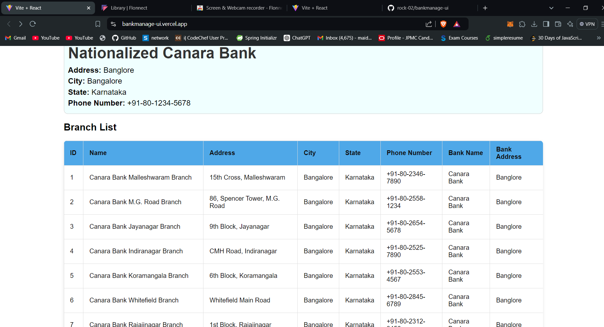
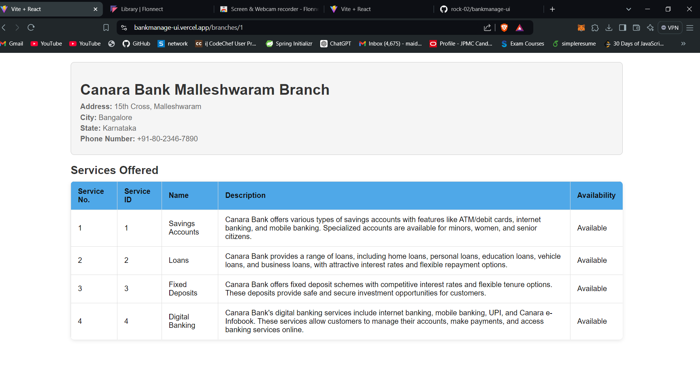

# React + Vite

This template provides a minimal setup to get React working in Vite with Hot Module Replacement (HMR) and some ESLint rules.

## Official Plugins

Currently, two official plugins are available:

- **[@vitejs/plugin-react](https://github.com/vitejs/vite-plugin-react/blob/main/packages/plugin-react/README.md)**: Uses [Babel](https://babeljs.io/) for Fast Refresh.
- **[@vitejs/plugin-react-swc](https://github.com/vitejs/vite-plugin-react-swc)**: Uses [SWC](https://swc.rs/) for Fast Refresh.

## Screenshots

### Bank Name and Branches List

This image shows the main view of the application, including the bank name and a list of its branches.

### Image of Bank Details

This screenshot provides a detailed view of bank information, including address, city, state, and phone number.

### Services Offered by Branch

This image displays the services offered by a specific branch, showcasing the various features and options available to customers.

## Features

- **Hot Module Replacement (HMR):** Fast refresh for a smoother development experience.
- **ESLint:** Integrated linting to help maintain code quality.

## Deployment

The application is deployed on Vercel. You can view it live at the following link:

[Bank Management UI](https://bankmanage-ui.vercel.app/)

## Backend

The backend for this project is implemented with Spring Boot. You can view the backend code and project details at the following link:

[Bank Backend Repository](https://github.com/rock-02/bankbackend)
